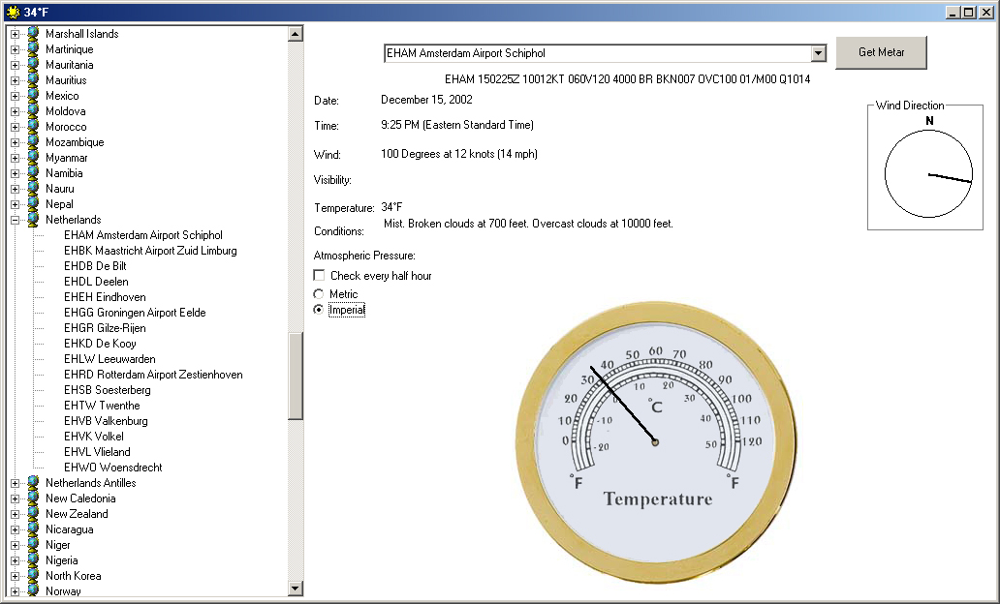



## Get METAR Version 3

### Description

>Version 3< ** Now includes Imperial/Metric Options! Improved searching! I've also included a pdf file about reading METAR data. This application will grab METAR (weather information) from airports around the world. It takes the METAR ticker string and translates alot of it to english. There's also code to write to a SQL (or access) database for analysis.
 
### More Info
 

             |
---                |---
**Submitted On**   |2002-12-14 21:44:04
**By**             |[James W\. Manning](https://github.com/Planet-Source-Code/PSCIndex/blob/master/ByAuthor/james-w-manning.md)
**Level**          |Intermediate
**User Rating**    |4.9 (68 globes from 14 users)
**Compatibility**  |VB 6\.0
**Category**       |[Complete Applications](https://github.com/Planet-Source-Code/PSCIndex/blob/master/ByCategory/complete-applications__1-27.md)
**World**          |[Visual Basic](https://github.com/Planet-Source-Code/PSCIndex/blob/master/ByWorld/visual-basic.md)
**Archive File**   |[Get\_METAR\_15134512142002\.zip](https://github.com/Planet-Source-Code/james-w-manning-get-metar-version-3__1-41521/archive/master.zip)

